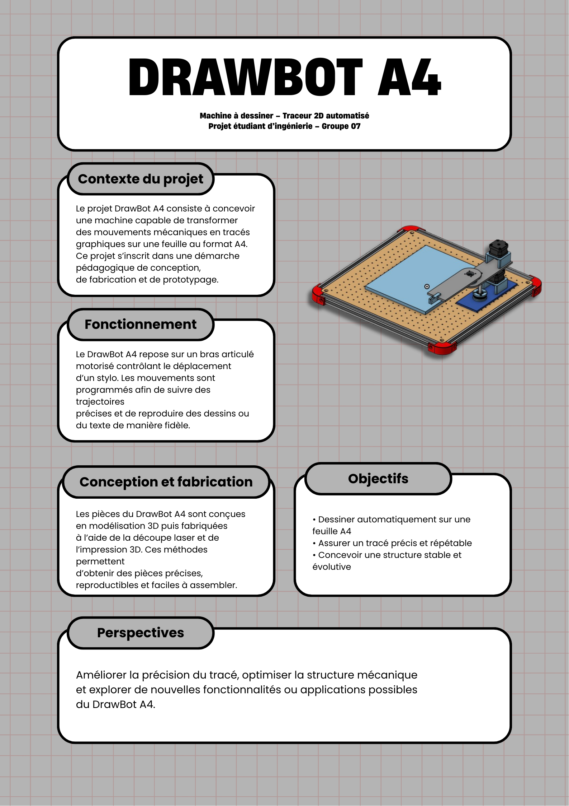

# Bienvenue sur notre documentation

Bienvenue dans la documentation de notre machine à dessiner nommée **"DrawBot A4"**.

Ce site a pour objectif de présenter notre projet, d’expliquer son fonctionnement et de fournir les informations nécessaires pour comprendre, utiliser et reproduire la machine.

Vous trouverez ci-dessous les principales ressources liées au projet, notamment les modèles 3D et le code source.

[Notre projet sur Onshape](https://cad.onshape.com/documents/2860ed3d58f1b518e6857770/w/82b3c0e474623135ccb76fa3/e/0cab16137cd459ee83ebe56e?renderMode=0&uiState=6936dc0e23fecc27d34268b2){: .btn .btn-primary .fs-5 .mb-4 .mb-md-0 .mr-2 }
[Notre dépôt GitHub](https://github.com/Makerspace-Amiens/2026-MachineThatDraws-Groupe07/){: .btn .fs-5 .mb-4 .mb-md-0 }

{: .note }
> Le modèle 3D et la vidéo de présentation seront mis à jour au fur et à mesure de l’avancement du projet.

<iframe
  height="600"
  width="100%"
  src="https://modelembedder.net/embed?did=e069393fab7baea4fdb59362&wvm=v&wvmid=7b5e182986723ef343886fa5&eid=e6b6ce24fbb03acfda1a5889&elementType=ASSEMBLY"
  frameborder="0">
</iframe>

## À propos du projet

Le **DrawBot A4** est une machine à dessiner utilisant un bras articulé.  
Ce projet nous permet d’apprendre et d’expérimenter la conception et la réalisation d’une machine répondant à un besoin concret : dessiner sur une feuille **A4**.

La machine peut également fonctionner comme un **traceur 2D**, capable de reproduire des images ou du texte de manière relativement précise.

## Poster du projet

## Vidéo de présentation

<video controls width="100%">
  <source src="images/video_drawbot_a4.mp4" type="video/mp4">
</video>
